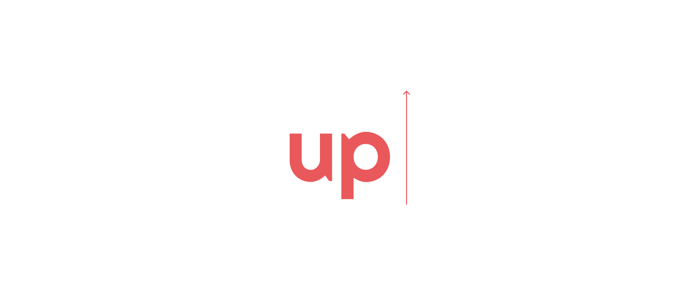

Simple tool to streaming upload remote url to google drive without download the file to local disk first.

Can be use to upload file that has size much bigger than the VPS disk space.

# Install on your local

- install direnv (https://direnv.net/)
- create `.envrc` with GOOGLEAUTH_CLIENT, GOOGLEAUTH_SECRET and REFRESH_TOKEN (use native app)
- run `direnv allow` to load env
- run `npm install`
- run `FILENAME=X REMOTE_URL=YY DRIVE_FOLDER_ID=ZZ node up.js`

# Sample of how to use

## Get remote urls from stdin

```js
const split = require('split')
const GriveUploader = require('./index')
const up = GriveUploader({
  client_id: process.env.GOOGLEAUTH_CLIENT,
  client_secret: process.env.GOOGLEAUTH_SECRET,
  refresh_token: process.env.REFRESH_TOKEN,
  drive_folder_id: process.env.DRIVE_FOLDER_ID
})

process.stdin.pipe(split()).pipe(up)
```

## Get remote urls from csv

```js
const fs = require('fs')
const split = require('split')
const GriveUploader = require('./index')

const up = GriveUploader({
  client_id: process.env.GOOGLEAUTH_CLIENT,
  client_secret: process.env.GOOGLEAUTH_SECRET,
  refresh_token: process.env.REFRESH_TOKEN,
  drive_folder_id: process.env.DRIVE_FOLDER_ID
})

fs.createReadStream('input.csv') // read the csv file
  .pipe(split()) // split the content into lines
  .pipe(up) // for each lines, upload to google drive
```

# Run as Docker

create a file in the host that contain the url, 1 per line and mount to container as `input.csv`

```bash
docker run -t --rm --name=up \
-v $(pwd)/input.csv:/input.csv
-e FILENAME=X \
-e DRIVE_FOLDER_ID=X \
-e GOOGLEAUTH_CLIENT=X \
-e GOOGLEAUTH_SECRET=X \
-e REFRESH_TOKEN=X \
quocnguyen/up
```

## License

(The MIT License)

Copyright (c) 2019 Quoc Nguyen &lt;quocnguyen@clgt.vn&gt; (the "Original Author") and additional contributors

Permission is hereby granted, free of charge, to any person obtaining
a copy of this software and associated documentation files (the
'Software'), to deal in the Software without restriction, including
without limitation the rights to use, copy, modify, merge, publish,
distribute, sublicense, and/or sell copies of the Software, and to
permit persons to whom the Software is furnished to do so, subject to
the following conditions:

The above copyright notice and this permission notice shall be
included in all copies or substantial portions of the Software.

THE SOFTWARE IS PROVIDED 'AS IS', WITHOUT WARRANTY OF ANY KIND,
EXPRESS OR IMPLIED, INCLUDING BUT NOT LIMITED TO THE WARRANTIES OF
MERCHANTABILITY, FITNESS FOR A PARTICULAR PURPOSE AND NONINFRINGEMENT.
IN NO EVENT SHALL THE AUTHORS OR COPYRIGHT HOLDERS BE LIABLE FOR ANY
CLAIM, DAMAGES OR OTHER LIABILITY, WHETHER IN AN ACTION OF CONTRACT,
TORT OR OTHERWISE, ARISING FROM, OUT OF OR IN CONNECTION WITH THE
SOFTWARE OR THE USE OR OTHER DEALINGS IN THE SOFTWARE.
